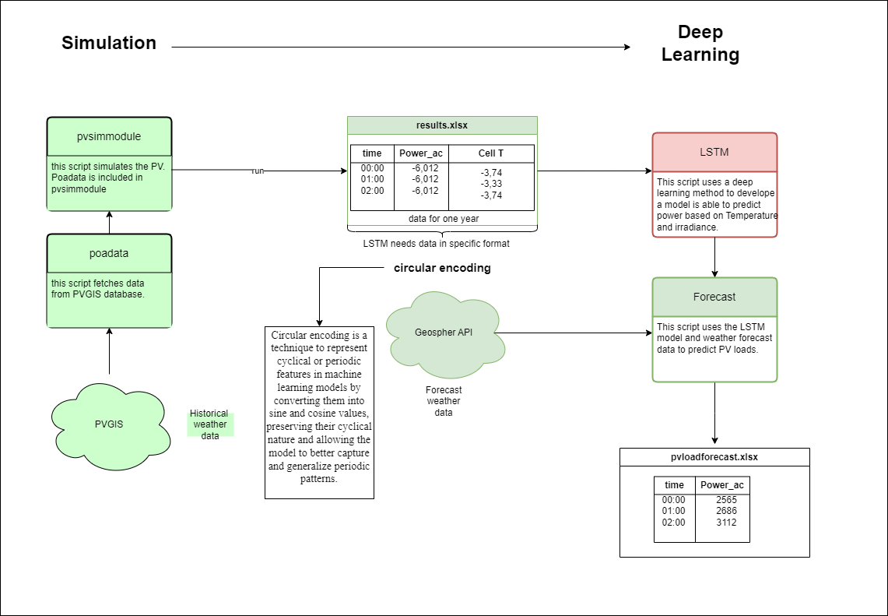

# PV Forecast

A machine learning-based photovoltaic power output forecasting system that combines weather data with LSTM neural networks to predict solar power generation. The system first simulates PV system performance, uses this data to train an LSTM model, and then provides power output forecasts based on weather predictions.

## Project Structure

```
PVFORECAST/
├── data/                      # Data files
│   ├── raw/                   # Raw input data
│   └── processed/             # Processed data
├── models/                    # Trained models
├── src/                       # Source code
├── docs/                      # Documentation
├── outputs/                   # Generated outputs
│   └── figures/               # Generated plots
└── tests/                     # Test files
```

## Features

- PV system simulation using PVLib
- Weather data integration from Geosphere Austria API
- LSTM-based power prediction model
- Detailed visualization of energy yield and predictions
- 24-hour ahead power generation forecasting

## Project Overview



The project consists of three main components that work in sequence:

### 1. Simulation Component
- **PVSimModule**: Simulates the PV system performance
- **POAData**: Fetches historical weather data from PVGIS database
- Outputs yearly power generation data in `results.xlsx`

### 2. Deep Learning Component
- Uses LSTM (Long Short-Term Memory) neural network
- Processes simulation data with circular encoding for temporal features
- Trains model to predict power output based on weather conditions

### 3. Forecasting Component
- Fetches weather forecast data from Geosphere API
- Uses trained LSTM model to predict power output
- Generates 24-hour ahead power forecasts in `pvloadforecast.xlsx`

## Installation

1. Clone the repository:

```bash
git clone https://git.unileoben.ac.at/m01601214/pvforecast.git
cd pvforecast
```

2. Install required packages:

```bash
pip install -r requirements.txt
```

Required packages include:
- pvlib
- tensorflow
- pandas
- numpy
- sklearn
- matplotlib
- requests
- openpyxl
- joblib

## Usage

The system operates in three sequential steps:

### 1. PV System Simulation
First, simulate the PV system's performance using historical data:

```bash
python src/pvsimmodule.py
```
This step:
- Calculates power output based on PV system parameters
- Processes weather data
- Generates initial dataset for model training
- Creates visualization plots of energy yield

### 2. LSTM Model Training
After generating the simulation data, train the LSTM model:

```bash
python src/lstma.py
```
This step:
- Processes the simulation data
- Trains the LSTM neural network
- Saves the trained model and scalers
- Provides performance metrics and visualizations

### 3. Power Output Forecasting
Finally, generate power output forecasts using the trained model:

```bash
python src/forecast.py
```
This step:
- Fetches weather forecast data from the API
- Uses the trained LSTM model to predict power output
- Provides hourly power predictions for the next 24 hours

## System Parameters

The system is configured for a photovoltaic installation with the following specifications:
- Location: Leoben, Austria (47.3877°N, 15.0941°E)
- Panel tilt: 30°
- Azimuth: 149.716°
- Cell type: Polycrystalline
- Rated DC power: 240W
- Modules per string: 23
- Strings per inverter: 3

## API Integration

The system uses the Geosphere Austria API for weather forecasting data, including:
- Temperature (°C)
- Wind speed (m/s)
- Global irradiation (J/m²)

## Output Files

The system generates several output files:
- `outputs/figures/energy_yield_start_to_end.png`: Time series plot of energy yield
- `outputs/figures/energy_yield_monthly_sum.png`: Monthly energy production
- `data/processed/results.xlsx`: Detailed simulation results
- `models/best_model.keras`: Trained LSTM model
- `models/power_forecast_model.keras`: Final forecasting model

## Authors

- Michael Grün (michaelgruen@hotmail.com)

## License

[Add your license information here]

## Project Status

Active development - Version 1.0
