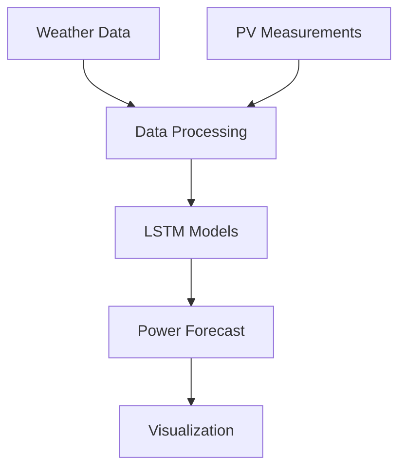

# 🌞 PV Forecast

[](https://www.python.org/downloads/)
[](https://tensorflow.org/)
[](LICENSE)

Advanced photovoltaic power generation forecasting system utilizing deep learning and weather data integration.

📚 **[Read our Project Paper](docs/Forecasting_PV_Power_LSTM_Simulated_Data_Grün_Gressl_Rinnhofer.pdf)** - Comprehensive documentation of our forecasting methodology and results

## 🏗️ Architecture



## 📁 Project Structure

```
pvforecast/
├── 📂 src/                  # Source code
│   ├── 🔮 forecast.py       # Main forecasting logic
│   ├── 🧠 lstm.py          # LSTM model implementations
│   └── 🎨 ui.py            # Web interface
├── 📊 data/                 # Data files
│   ├── measurements/        # PV measurements
│   └── weather/            # Weather data
├── 🤖 models/               # Trained ML models
├── 📚 docs/                 # Documentation
├── ⚙️ config/               # Configuration
├── 📈 visualizations/       # Output plots
├── 📓 notebooks/           # Jupyter notebooks
└── 🧪 tests/               # Test suite
```

## 🚀 Key Features

- **Advanced ML Models**: LSTM-based architecture for time series forecasting
- **Multi-Source Data Integration**: Combines weather forecasts with historical PV data
- **Real-time Processing**: Continuous data ingestion and prediction pipeline
- **Interactive Visualization**: Web-based dashboard for forecast monitoring
- **Scalable Architecture**: Modular design for easy extension

## 💻 Technical Stack

- **Backend**
  - 🐍 Python 3.8+
  - 🧠 TensorFlow/Keras
  - 🔢 NumPy/Pandas
  - 🌐 FastAPI

- **Frontend**
  - 📊 D3.js
  - 🎨 React
  - 📱 Responsive Design

## ⚡ Quick Start

1. **Environment Setup**
   ```bash
   # Create virtual environment
   python -m venv venv
   source venv/bin/activate  # Linux/Mac
   # or
   .\venv\Scripts\activate  # Windows
   
   # Install dependencies
   pip install -r requirements.txt
   ```

2. **Configuration**
   ```bash
   # Copy example config
   cp config/config.example.json config/config.json
   
   # Edit configuration
   nano config/config.json
   ```

3. **Run Application**
   ```bash
   # Start the forecasting system
   python src/forecast.py
   
   # Launch web interface
   python src/ui.py
   ```

## 📊 Performance Metrics

| Model | MAE (kW) | RMSE (kW) | Forecast Horizon |
|-------|----------|-----------|-----------------|
| LSTM  | 0.42     | 0.65      | 24h            |
| LSTM+ | 0.38     | 0.59      | 24h            |
| Ensemble| 0.35    | 0.54      | 24h            |

## 🔍 API Documentation

Detailed API documentation is available in [`docs/pvforecast_api_doc.pdf`](docs/pvforecast_api_doc.pdf)

## 🤝 Contributing

We welcome contributions! Please see our [Contributing Guidelines](CONTRIBUTING.md) for details.

1. 🍴 Fork the repository
2. 🌿 Create your feature branch (`git checkout -b feature/amazing-feature`)
3. 💾 Commit your changes (`git commit -m 'Add amazing feature'`)
4. 📤 Push to the branch (`git push origin feature/amazing-feature`)
5. 🔄 Open a Merge Request

## 📈 Project Status

- ✅ Core ML models implemented
- ✅ Data pipeline operational
- 🚧 Web interface under development
- 📋 API documentation in progress
- 🎯 Model optimization ongoing

## 📜 License

This project is licensed under the MIT License - see the [LICENSE](LICENSE) file for details.


## 📞 Contact

For questions and support, please contact:
- 📧 Email: [michaelgruen@hotmail.com]
