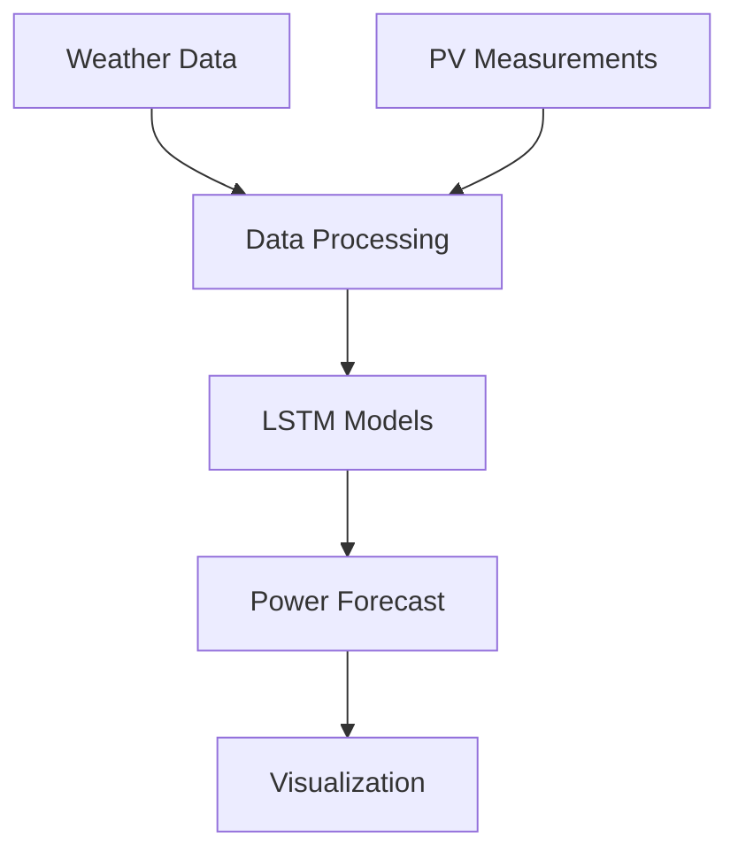

# � PV Forecast

[](https://www.python.org/downloads/)
[](https://tensorflow.org/)
[](LICENSE)

Advanced photovoltaic power generation forecasting system utilizing deep learning and weather data integration.

í³š **[Read our Project Paper](Forecasting_PV_Power_LSTM_Simulated_Data_Grün_Gressl_Rinnhofer.pdf)** - Comprehensive documentation of our forecasting methodology and results

## í¿—ï¸� Architecture



## � Project Structure

```
pvforecast/
├── í³‚ src/                  # Source code
│   ├── í´® forecast.py       # Main forecasting logic
│   ├── í·  lstm.py          # LSTM model implementations
│   └── í¾¨ ui.py            # Web interface
├── í³Š data/                 # Data files
│   ├── measurements/        # PV measurements
│   └── weather/            # Weather data
├── í´– models/               # Trained ML models
├── í³š docs/                 # Documentation
├── ⚙� config/               # Configuration
├── í³ˆ visualizations/       # Output plots
├── í³“ notebooks/           # Jupyter notebooks
└── í·ª tests/               # Test suite
```

## íº€ Key Features

- **Advanced ML Models**: LSTM-based architecture for time series forecasting
- **Multi-Source Data Integration**: Combines weather forecasts with historical PV data
- **Real-time Processing**: Continuous data ingestion and prediction pipeline
- **Interactive Visualization**: Web-based dashboard for forecast monitoring
- **Scalable Architecture**: Modular design for easy extension

## í²» Technical Stack

- **Backend**
  - í°� Python 3.8+
  - í·  TensorFlow/Keras
  - í´¢ NumPy/Pandas
  - � FastAPI

- **Frontend**
  - í³Š D3.js
  - í¾¨ React
  - í³± Responsive Design

## âš¡ Quick Start

1. **Environment Setup**
   ```bash
   # Create virtual environment
   python -m venv venv
   source venv/bin/activate  # Linux/Mac
   # or
   .\venv\Scripts\activate  # Windows
   
   # Install dependencies
   pip install -r requirements.txt
   ```

2. **Configuration**
   ```bash
   # Copy example config
   cp config/config.example.json config/config.json
   
   # Edit configuration
   nano config/config.json
   ```

3. **Run Application**
   ```bash
   # Start the forecasting system
   python src/forecast.py
   
   # Launch web interface
   python src/ui.py
   ```

## í³Š Performance Metrics

| Model | MAE (kW) | RMSE (kW) | Forecast Horizon |
|-------|----------|-----------|-----------------|
| LSTM  | 0.42     | 0.65      | 24h            |
| LSTM+ | 0.38     | 0.59      | 24h            |
| Ensemble| 0.35    | 0.54      | 24h            |

## í´� API Documentation

Detailed API documentation is available in [`docs/pvforecast_api_doc.pdf`](docs/pvforecast_api_doc.pdf)

## í´� Contributing

We welcome contributions! Please see our [Contributing Guidelines](CONTRIBUTING.md) for details.

1. í½´ Fork the repository
2. í¼¿ Create your feature branch (`git checkout -b feature/amazing-feature`)
3. �� Commit your changes (`git commit -m 'Add amazing feature'`)
4. í³¤ Push to the branch (`git push origin feature/amazing-feature`)
5. í´„ Open a Merge Request

## í³ˆ Project Status

- ✅ Core ML models implemented
- ✅ Data pipeline operational
- íº§ Web interface under development
- í³‹ API documentation in progress
- í¾¯ Model optimization ongoing

## í³œ License

This project is licensed under the MIT License - see the [LICENSE](LICENSE) file for details.

## í¼¦ï¸� Weather Data Source

The weather forecast data is provided by GeoSphere Austria's AROME (Application of Research to Operations at MEsoscale) model with the following specifications:

- **Spatial Resolution**: 2.5 km grid
- **Temporal Resolution**: Hourly data
- **Update Frequency**: Recalculated every 3 hours
- **Forecast Horizon**: 60 hours
- **Geographic Coverage**: 42.98° - 51.82° N, 5.49° - 22.1° E (extended Alpine region)
- **Projection**: WGS84 - World Geodetic System 1984 (EPSG: 4326)
- **Parameters**: Temperature, precipitation, wind, global radiation, relative humidity, thunderstorm indices, cloud cover, pressure
- **License**: Creative Commons Attribution 4.0
- **DOI**: https://doi.org/10.60669/9zm8-s664
- **Model Development**: The AROME model code is developed in collaboration with partner weather services of the ACCORD consortium

## � Contact

For questions and support, please contact:
- í³§ Email: [michaelgruen@hotmail.com]

