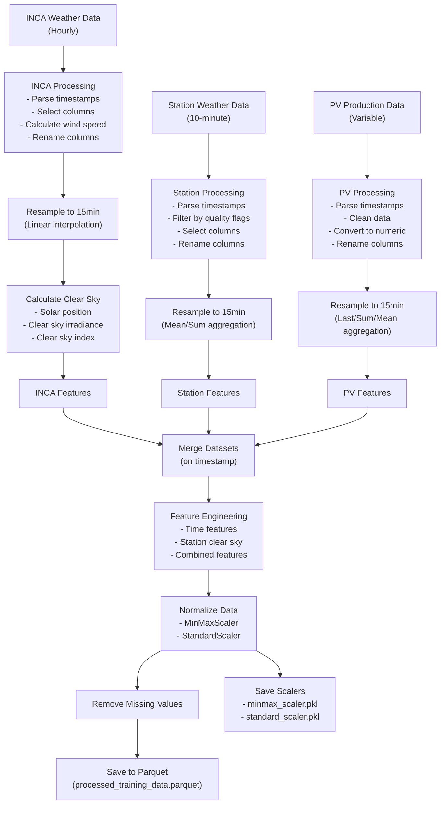

# Data Processing for PV Forecasting

This document explains the data sources and preprocessing steps used in the PV forecasting project.

## Data Processing Flowchart

## Data Sources

The project uses three main data sources that are processed and merged to create the training dataset:

| Data Source | File Path | Description | Original Frequency |
|-------------|-----------|-------------|-------------------|
| INCA Weather Data | `data/inca_data_evt/INCA analysis - large domain Datensatz_20220713T0000_20250304T2300 (1).csv` | Weather forecast data including global radiation, temperature, humidity, and wind components | Hourly |
| Station Weather Data | `data/station_data_leoben/Messstationen Zehnminutendaten v2 Datensatz_20220713T0000_20250304T0000.csv` | Local weather station measurements including global radiation, temperature, wind speed, precipitation, and pressure | 10-minute |
| PV Production Data | `data/raw_data_evt_act/merge.CSV` | Actual power output from the PV system including energy and power measurements | Variable |

### INCA Weather Data Source

The INCA (Integrated Nowcasting through Comprehensive Analysis) system is provided by GeoSphere Austria. It combines multiple data sources:
- Weather station observations
- Remote sensing data
- Numerical weather prediction models
- High-resolution terrain model

This integrated approach creates a comprehensive analysis of the current state of the atmosphere. The INCA data has:
- Spatial resolution: 1 km x 1 km
- Temporal resolution: 1 hour
- Coverage area: 45.77° - 49.48° N, 7.1° - 17.74° E
- Projection: MGI / Austria Lambert (EPSG: 31287)
- Parameters: Temperature, precipitation, wind, global radiation, relative humidity, dew point, air pressure
- License: Creative Commons Attribution 4.0
- DOI: https://doi.org/10.60669/6akt-5p05

The INCA system is used for flood warnings and forecasts, as well as for internet portals with spatially and temporally detailed meteorological information.

### Station Weather Data Source

The station data comes from GeoSphere Austria's weather station network. Like the INCA system, it integrates:
- Station observations
- Remote sensing data
- Numerical weather prediction models
- High-resolution terrain model

The station data provides more localized and higher frequency measurements than the INCA system:
- Temporal resolution: 10 minutes
- Parameters: Temperature, precipitation, wind, global radiation, relative humidity, dew point, air pressure
- License: Creative Commons Attribution 4.0

### PV Production Data Source

The PV production data comes from Fronius Solar.web, a monitoring platform for photovoltaic systems. The system requires:
- Fronius inverters with integrated data communication
- Fronius Smart Meter for power consumption monitoring

The Solar.web platform provides:
- Current values and daily progress curves
- Energy yield and CO2 savings analysis
- Access to historical energy data
- Available as both web interface and mobile app

## Preprocessing Steps

### 1. INCA Weather Data Processing
- Parse timestamps with format `%Y-%m-%dT%H:%M+00:00`
- Select relevant columns: global radiation, temperature, humidity, wind components
- Calculate total wind speed from east (UU) and north (VV) components
- Rename columns with 'INCA_' prefix for clarity
- Resample to 15-minute intervals using linear interpolation
- Calculate clear sky irradiance values using pvlib's simplified Solis model
- Calculate clear sky index (ratio of measured to clear sky radiation)

### 2. Station Weather Data Processing
- Parse timestamps with format `%Y-%m-%dT%H:%M+00:00`
- Filter data based on quality flags (keeping only flag value 12)
- Select relevant columns: global radiation (cglo), temperature (tl), wind speed (ff), precipitation (rr), pressure (p)
- Rename columns with 'Station_' prefix for clarity
- Resample to 15-minute intervals using appropriate aggregation methods:
  - Mean for radiation, temperature, wind speed, pressure
  - Sum for precipitation

### 3. PV Production Data Processing
- Parse timestamps with format `%d.%m.%Y %H:%M`
- Clean and convert data to numeric values
- Rename columns to standardized names: energy_wh, energy_interval, power_w
- Resample to 15-minute intervals using appropriate aggregation methods:
  - Last value for cumulative energy
  - Sum for interval energy
  - Mean for power

### 4. Feature Engineering
- Add time-based features:
  - Hour of day
  - Day of year
  - Cyclical encoding of hour (sin/cos)
  - Cyclical encoding of day of year (sin/cos)
- Calculate clear sky values for station data
- Calculate station clear sky index
- Create combined features by averaging INCA and station data:
  - Combined global radiation
  - Combined temperature
  - Combined wind speed
  - Combined clear sky index

### 5. Data Normalization
- Apply MinMaxScaler (0-1 range) to:
  - Radiation features (INCA, station, combined)
  - Clear sky irradiance components
  - PV output features (power, energy)
  - Cyclic features (already in -1 to 1 range)
- Apply StandardScaler (zero mean, unit variance) to:
  - Weather measurements (temperature, humidity, wind speed)
  - Clear sky indices
- Save scalers to `models/minmax_scaler.pkl` and `models/standard_scaler.pkl`

### 6. Data Integration
- Merge all datasets on timestamp index
- Remove rows with missing values
- Save final processed dataset to `data/processed_training_data.parquet` using Snappy compression

## Output

The final processed dataset contains aligned and normalized weather and PV production data at 15-minute intervals, ready for training machine learning models for PV power forecasting.